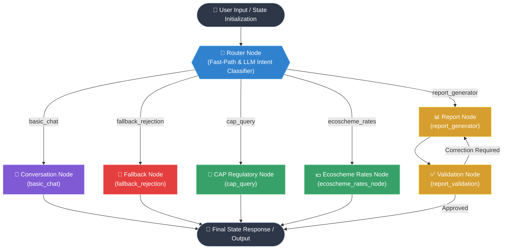

## 🧠 AgrIA Agentic Workflow Architecture

AgrIA uses a **LangGraph-driven stateful orchestration engine** that processes multi-modal agricultural queries, parcel visual metadata, and European Union / Spanish CAP (PAC) regulatory inquiries.

### 📐 Graph Topology Diagram



## 🏛️ Architecture & Component Breakdown

### 1. State Management (`AgrIAState`)
The agent maintains an immutable execution state passed between nodes:
* `messages`: Full conversation thread (`List[BaseMessage]`).
* `lang`: Target response language (`"es"` | `"en"`).
* `crop_metadata`: SIGPAC / GIS parcel JSON payload (if provided).
* `visual_description`: Multi-modal VLM scene analysis.
* `correction_feedback`: Self-correction loop feedback for report generation.

---

### 2. Node Responsibilities

| Node Name | Module Path | Description / Scope |
| :--- | :--- | :--- |
| **Router** | `nodes/router_node.py` | Dual-mode intent classifier. Uses **Fast-Path** regex detection for rapid report triggers (`###DESCRIBE_SHORT_IMAGE###`) or a **Structured JSON LLM call** for natural language routing. |
| **Conversation** | `nodes/conversation_node.py` | Handles general domain chit-chat, greetings, and high-level non-regulatory agricultural questions. |
| **Fallback** | `nodes/fallback_node.py` | Out-of-scope filter. Politeness rejection for queries unrelated to agriculture, crops, or farming. |
| **CAP Query** | `nodes/cap_query.py` | Local RAG pipeline powered by **ChromaDB**. Retrieves semantically relevant legal contexts from regional/national PAC regulatory PDFs and `.md` files. |
| **Ecoscheme Rates** | `nodes/ecoscheme_rates_node.py` | Direct context injection node for Campaign Eco-scheme rates, financial thresholds, multi-annual premiums, and payment tables. |
| **Report** | `nodes/report_node.py` | Generates comprehensive parcel diagnostic reports combining SIGPAC metadata and VLM visual descriptions. |
| **Validation** | `nodes/validation_node.py` | Automated self-reflection node that evaluates generated reports against required schema metrics before returning output to the user. |

---

### 3. Vector Database & RAG Stack
* **Storage Engine**: Embedded ChromaDB (`VECTOR_DB_PATH`).
* **Embeddings**: Local ONNX / standard sentence-transformers (`all-MiniLM-L6-v2`).
* **Retrieval Mode**: Top-$k$ similarity search with metadata-preserved Markdown chunking (`RecursiveCharacterTextSplitter`).

---

## 🧪 Testing

Run the full automated pytest suite covering all graph execution paths (Tests A through E):

```bash
cd AgrIA_server
uv run pytest test/ -vv
```