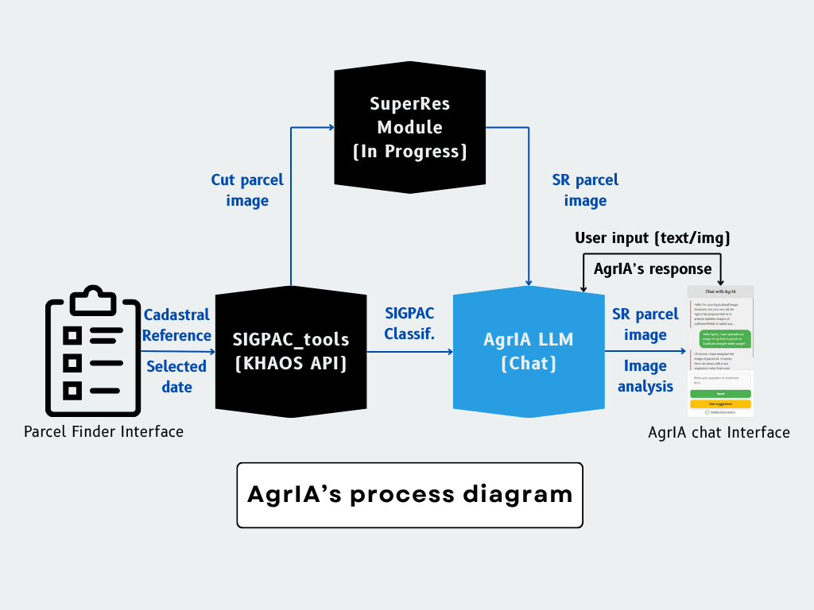
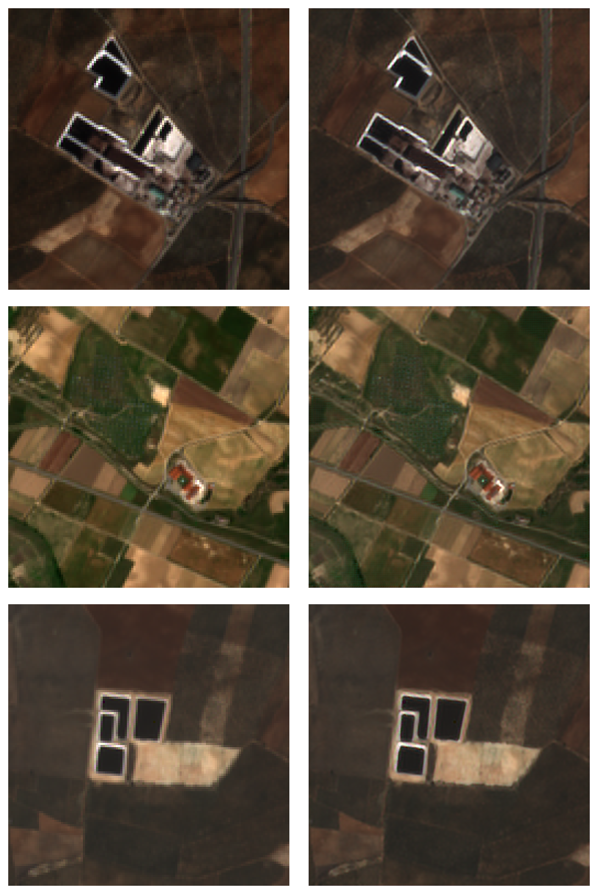

# Agricultural Imaging Assistant (AgrIA)

<div align="center">
  
</div>


AgrIA (Agricultural Image Assistant) is an **integrated image analysis and intelligent chat tool that specializes in agricultural satellite image classification**. Designed to assist farmers and landowners, AgrIA facilitates crop valuation and provides a report that helps them **qualify for various European Union eco-scheme aids within the framework of the Common Agricultural Policy (CAP).** It is currently only applicalbe to Spain's national territory and fields, but allows modification to adapt to other EU member states.

It leverages an Angular-based frontend and a FastAPI Python server logic along with access to Google's Gemini LLM provided an API key and a Super-Resolution module for improved image visualization.

This repository contains the unified source code for both the Frontend UI (`AgrIA_UI`) and the Python Backend services (`AgrIA_server`).

## Main features:
- **Parcel Location:** Automatically find your parcel by simply using its cadastral reference, address or drawing/locating it in the map interface.
- **Image Super-Resolution:** Improved 10m/px image resolution up to 2,5m/px thanks to the [SEN2SR](https://github.com/ESAOpenSR/SEN2SR.git) implementation of a Deep Learning model.
- **Satellite Image Analysis:** Get an accurate description of your fields from Sentinel satellite images that provide a detailed view of the terrain.
- **Resource Analysis:** Receive personalized recommendations for efficient space utilization, crop species, and other resources.
- **CAP Advisory:** Get expert guidance on how to meet Common Agricultural Policy subsidy criteria.
- **Interactive Support:** Interact with AgrIA through chat and receive updated answers about your crops.

## Requirements:
In order to run `AgrIA` properly, you will need the following:
- `Python 3.10+` (available at [www.python.org](https://www.python.org/downloads/)).
- `Conda` package manager (installment guide available at [conda.io](https://docs.conda.io/projects/conda/en/latest/user-guide/install/index.html)).
- `Node.js` and `npm` (download tutorial available at [npmjs.com](https://docs.npmjs.com/downloading-and-installing-node-js-and-npm)).
    - `Angular CLI` (easy to get if you have `npm` by just using `npm install -g @angular/cli`).
- Have the `AgrIA_server/.env` file setup and have the `GEOJSON_FILE` constant set (see [`AgrIA_server/README.md`](AgrIA_server/README.md)). This last file is essential if you want access to the MinIO database.

## Quickstart:
In order to get AgrIA started, you will need to assign the essential environment variables:
1. **Copy the environment template file:**
    ```bash
    cp .env.example .env
    ```
2. **Set the variables:** Depending whether you choose **Option 1** (*User mode*) or **Option 2** (*Dev mode*), configure the variables as you need.

> *NOTE:* The `NON-ESSENTIAL VARIABLES` may be assigned but will only be used for benchmarking purposes (available by modifying the code in *Dev mode*).

### Option 1: Docker (User mode)
You can easily deploy AgrIA by installing **[Docker](https://docs.docker.com/get-started/get-docker/)** and running the following command:
```bash
cd AgrIA
docker compose up --build
```
Be advised, given the specialized Machine Learning dependencies (Pytorch), the first time building the backend might might make the process take considerable time, depending on processing power (10+ minutes). On the other hand, no other additional installation is required this way. This is ideal for those users that want to deploy and use AgrIA

### Option 2: Cloning and running the project (Dev mode)
Alternatively, you can clone/download the repository files and follow these instructions to run AgrIA while still having access to the code. Ideal for developers.
```bash
git clone https://github.com/KhaosResearch/AgrIA.git
cd AgrIA
```
### Setup
Each component (`AgrIA_UI` & `AgrIA_server`) has their own detailed documentation, but for a quickstart, here are the essentials:
1. Open a terminal window on root dir (`AgrIA`) and run this command to initialize the frontend:
```bash
cd AgrIA_UI
npm install
ng serve
```
2. Open a new terminal window on root dir to setup and run the backend:
```bash
cd AgrIA_server
conda env create -f environment.yml -y
conda activate agria_server_env
python run.py
```
Everything should be up and running at `http://localhost:4200`, which is the default port. If you are using another one (by running `ng serve XXXX`), make sure to update the `AgrIA_server/.env` file.

## AgrIA's pipeline:
In order to find the parcel, users have 3 options:
- **Use Cadastral data:** Only the cadastrals code is required. AgrIA will retrieve the parcel's image and metadata with crop info.
- **Use Location data:** Fill out the address input fields (provinde, municipality, etc...) and Agria will automatically fetch the necessary data.
- **Use Geographical data:** Whether the user clicks on their parcel and uses the coordinates or draws the outlines on the map, AgrIA will return the image, but **it will automatically get the crop classification data only for the Spanish territory. The user must manually draw the parcel in the map and fill out crop information for other countries via the form** before retrieving the parcel's image.

The following diagram details AgrIA`s parcel finding pipeline when both image and metadata are returned.:



### Diagram explanation
#### Land use automatic extraction (Spain only)
1. User provides the cadastral reference code/parcel location data or click in your parcel and selects the date they want the image to be taken from.

2. These two parameters are passed to the `sigpac_tools` API:
    - The API finds the parcel and gets the GeoJSON geometry and its metadata.
    - The geometry is used to locate the parcel and dowload the Sentinel tiles available for the selected date.
    - The metadata contains the SIGPAC crop classification that is formatted into a prompt recognisible for the AgrIA LLM.

3. A crop containing the parcel geometry is made out of the downloaded Sentinel tiles and the SEN2SR implementation uses the model to upscale it to a better resolution (10m/px --> 2.5m/px). See examples:

<center>



</center>

4. Both the formatted SIGPAC crop classification and the super-resolved image are passed to the backend. Using the Hybrid JSON-CLM approach, the server classifies the land uses into Ecoschemes and generates a JSOn with all of the relevant informatio. This JSON is then passed to the model.
    - The model leverages the provided text info with the visual data.
    - The model uses its context documents and system instructions to provide the output in a human-readable format.

5. All of the SIGPAC info, super-resolved image and prompt output is then passed to the *Chat* view, where the user can see the final result.
    - Users may also interact with follow-up propmts in the same conversation.
    - Thanks to the context documents on CAP, the Chat is ready for any related topic discussion.

#### Land use manual input (Rest of the world)
The process is the same, only more manual input is required:
- User needs to draw the state/parcel's limits on the map and indicate the land uses (SIGPAC format) using the SIGPAC Classification form.
- After finding  the parcel and the super-resolved cropped image and land use information are confirmed, all data will be sent to the Chat Assistant to assess the parcel.
- **NOTE: AgrIA will apply rates from the latest Spain's CAP Strategic Plan**. User's will need to provide new data to the Chat in order for AgrIA to update the rates accordingly.
