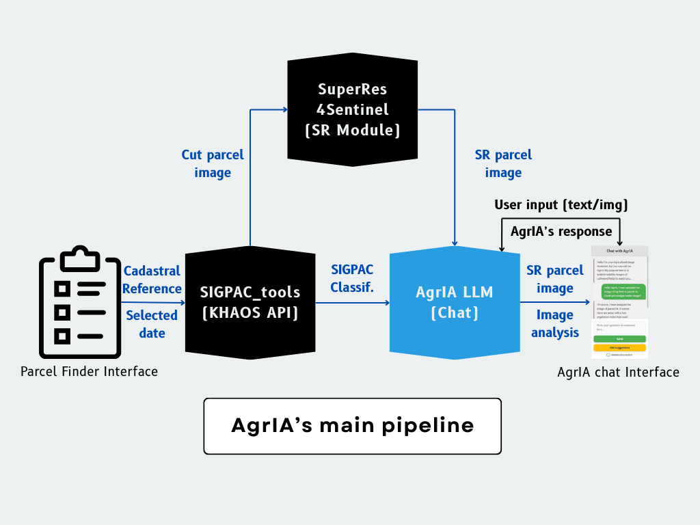

# Agricultural Imaging Assistant (AgrIA)

<div align="center">
  
</div>

The Agricultural Imaging Assistant (AgrIA) is an AI-powered tool that combines image analysis and classification with real time LLM commentary and interaction. Its main purpose is to assess crop satellite images and help farmers and landowners qualify for EU's Common Agriculture Policies subventions. 

It leverages an Angular-based frontend and a FLASK Python server logic along with access to Google's Gemini LLM provided an API key and a Super-Resolution module for improved image visualization.

## Main features:
- **Parcel Location:** Automatically find your parcel by simply using its cadastral reference, address or drawing/locating it in the map interface.
- **Image Super-Resolution:** Improved 10m/px image resolution up to 5m/px thanks to the [SuperRes4Sentinel](https://github.com/MiguelPadillaR/SuperRes4Sentinel.git) implementation of a [L1BSR](https://github.com/centreborelli/L1BSR) pre-trained model.
- **Satellite Image Analysis:** Get an accurate description of your fields from Sentinel satellite images that provide a detailed view of the terrain.
- **Resource Analysis:** Receive personalized recommendations for efficient space utilization, crop species, and other resources.
- **CAP Advisory:** Get expert guidance on how to meet Common Agricultural Policy subsidy criteria.
- **Interactive Support:** Interact with AgrIA through chat and receive updated answers about your crops.

## Requirements:
In order to run `AgrIA` properly, you will need the following:
- `Python 3.10+` (available at [www.python.org](https://www.python.org/downloads/)).
- `Conda` package manager (installment guide available at [conda.io](https://docs.conda.io/projects/conda/en/latest/user-guide/install/index.html)).
- `Node.js` and `npm` (download tutorial available at [npmjs.com](https://docs.npmjs.com/downloading-and-installing-node-js-and-npm)).
- `Angular CLI` (easy to get if you have `npm` by just using `npm install -g @angular/cli`).

## Quickstart:
### Cloning this repository:
- If you have not cloned the repository yet, use the following command to clone and initialize the submodules simultanously:
```bash
git clone --recurse-submodules https://github.com/KhaosResearch/AgrIA.git
```
- If you have already cloned the repository on your system, initialize the submodules with:
```bash
git submodule update --init --recursive
```
### Setup
Each submodule (`AgrIA_UI` & `AgrIA_server`) have their own detailed documentation, but for a quickstart, here are the essentials:
1. Have the `AgrIA_server/.env` file and the the `GEOJSON_FILE` ready
2. Initialize and run the frontend:
```bash
cd AgrIA_UI
npm install
ng serve
```
3. Open a new terminal window to setup and run the backend:
```bash
cd /AgrIA_server
conda env create -f environment.yml -y
conda activate agria_server_env
python run.py
```
Everything should be up and running at `http://localhost:4200`, which is the default port. If you are using another one (by running `ng serve XXXX`), make sure to update the `AgrIA_server/.env` file.

## AgrIA's pipeline:
In order to find the parcel, users have 3 options:
- **Use Cadastral data:** Only the cadastrals code is required. AgrIA will retrieve the parcel's image and metadata with crop info.
- **Use Location data:** Fill out the address input fields (provinde, municipality, etc...) and Agria will automatically fetch the necessary data.
- **Use Geographical data:** Whether the user clicks on their parcel and uses the coordinates or draws the outlines on the map, AgrIA will return the image, but **it will not automatically get the crop classification data. The user must manually fill out that information** before retrieving the parcel's image.

The following diagram details AgrIA`s parcel finding pipeline when both image and metadata are returned.:



### Diagram explanation
1. User provides the cadastral reference code/parcel location data and selects the date they want the image to be taken from.

2. These two parameters are passed to the `sigpac_tools` API:
    - The API finds the parcel and gets the GeoJSON geometry and its metadata.
    - The geometry is used to locate the parcel and dowload the Sentinel tiles available for the selected date.
    - The metadata contains the SIGPAC crop classification that is formatted into a prompt recognisible for the AgrIA LLM.

3. A crop containing the parcel geometry is made out of the downloaded Sentinel tiles and the SuperRes4Sentinel implementation uses the pre-trained module to upscale it to a better resolution (10m/px --> 5m/px). See example:


4. Both the formatted SIGPAC crop classification and the super-resolved image are passed in a single prompt to the model.
    - The model leverages the provided text info with the visual data.
    - The model uses its context documents and system instructions to provide the output of a specific format.

5. All of the SIGPAC info, super-resolved image and prompt output is then passed to the *Chat* view, where the user can see the final result.
    - Users may also interact with follow-up propmts in the same conversation.


>### WARNING: Using the Chat for parcel image evaluation:
>**Using the *Parcel Finder*** view leads to retrieving the parcel's image and SIGPAC's crop classification and data, resulting in **a much more accurate evaluation of the parcel** and a more fruitful user interaction. **However, the user may interact directly with the chat,** without going through the *Parcel finder* module in order to solve other type of agriculture-related issues. Nevertheless, **if the user wants to analyze their state by manually uploading a picture,** AgrIA will return a rough description of what's shown and will **prompt the user for more information in order to improve analysis precision.** The model expects to be provided information about the crop types and each parcel's admisible surface. As shown in the diagram, this process is automated when using the *Parcel finder* view.
<details>
<summary style="font-size: larger; font-weight: bold;">
About contributing to this repository
</summary>

## HOW TO CONTRIBUTE:

**This repository contains access to submodules (subrepositories).** In order to learn more about submodules, there is useful info available at the [git-submodule documentation](https://git-scm.com/docs/git-submodule). As a summary, **have the following indications into account when working on this repository:**
### Pushing (local -> remote):
Whenever you access `AgrIA_UI` or `AgrIA_UI` it will be as if you were working on their respetive remote repositories (submodules), so any changes will have to be integrated with the branch `AgrIA`'s main repository pulls from (usually, the default branch, `main`). Open and close branches as you need then merge changes into the default submodule's branch.

In order to integrate changes into the main repository, go back to its root directory, add the changes coming from the submodules and commit as usual:
```bash
git add . # or git add AgrIA_UI or git add AgrIA_server to add individual changes
git commit -am "Integrating changes: blah blah blah..."
git push origin main # or whatever main branch you have
```

Make sure all changes are pushe FIRST on the submodules and AFTER on `AgrIA`'s main repository.
### Pulling (remote -> local):
Bringing changes to the local repository is a two-step process done from the root directory:
1. Pull changes to the main local repository
```bash
git pull origin main # or whatever branch you need
```
2. Pull changes from the submodules
```bash
git submodule update --remote --recursive
```
</details>

