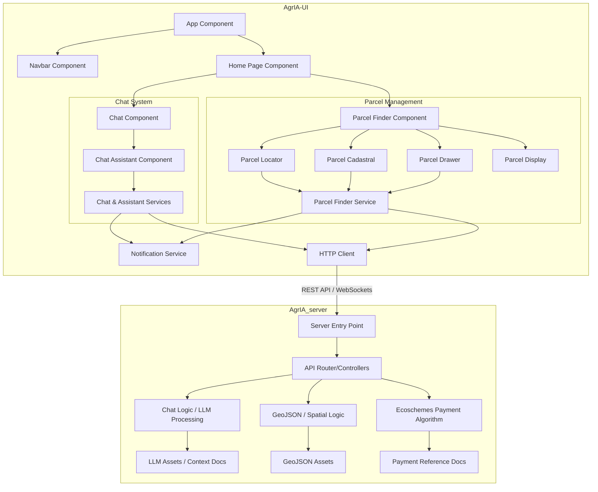

# Project Architecture

## Overview
A specialised tool designed for farmers and landowners to use. It implements a Chat Assistant interface users can use to make agronomic consultations regarding the European Union's Common Agricultural Policy (CAP) and general crop management. Its main functionality provides a comprehensive parcel evaluation using either a valid cadastral reference (Spain) or GeoJSON and land use data (Spain and rest of Europe, using the provided interface). The Chat's reply includes a detailed assessment to qualify for the different aids provided by the CAP and an upscaled satellite real time image of the parcel.

Current drawbacks: It only applies to Spain an EU areas due to the scope of the tool. Substantial modifications need to be made to the Chat model's system instructions and prompt tuning in order to adapt it for similar use cases around the world.

The following diagram displays the core processes involved:

## Components Diagram
The following diagram displays the relations between the frontend and backend components:

Podrías explicar los componentes principales del sistema y cómo se relacionan entre sí.

## Technologies
Podrías listar las tecnologías principales que se usan en el proyecto.

- Backend: ...
- Frontend: ...
- Databases: By default, AgrIA retrieves the images from **[CUBO](https://github.com/ESDS-Leipzig/cubo)**, downloading the necessary image bands and composing the image. However, other options include:
    - **MinIO:** By setting the correct `.env` variables to KHAOS's Sentinel image database credentials, AgrIA can directly download the pre-composed images. Given these images are monthly composites, exact date is ignored.
    - **SentinelHub:** Using Copernicus credentials and setting up a free account (also adjustable using the `.env` vars), the SentinelHub API can query for the parcel images. This option is only used for benchmarking purposes with the SR4S module

## Design Decisions
Podrías explicar las decisiones de diseño que se tomaron para el proyecto.

- Decision 1: ...
- Decision 2: ...
