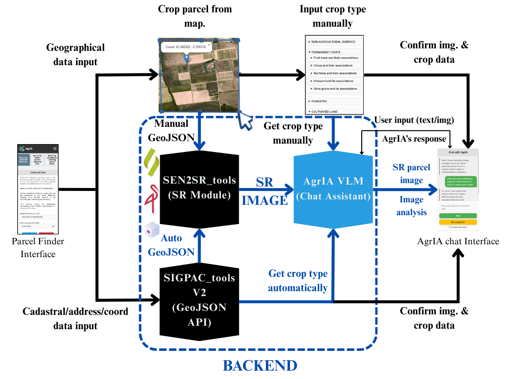
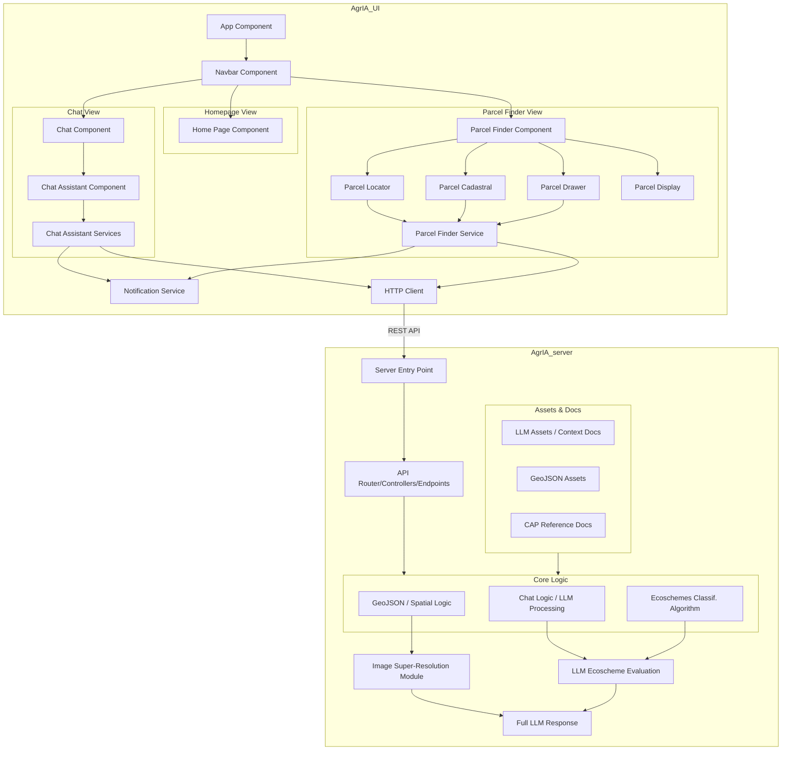

# Project Architecture

## Overview
Through and integrated image analysis and intelligent chat tool that specializes in agricultural satellite image classification, AgrIA facilitates crop valuation and provides a report that helps them **qualify for various European Union eco-scheme aids within the framework of the Common Agricultural Policy (CAP).**
- **End users:** EU's farmers and landowners .
- **Main components:** 
    - **Homepage:** Landing page with a general explanation of the tool's purpose and usage.
    - **Parcel finder:** An interface to help users find their parcel and retrieve relevant land use data for crop classifcation. It uses either a valid cadastral reference (Spain) or GeoJSON and land use data (Spain and rest of Europe)
    - **Chat Assistant:** An interface to make agronomic consultations to a fine-tuned Gemini-sourced AI model trained on European Union's Common Agricultural Policy (CAP) regulations and general crop management. 
- **Main output:** 
    - **Parcel finder:** An upscaled satellite real time image of the parcel.
    - **Chat Assistant:** A comprehensive parcel evaluation and a detailed assessment to qualify for the different aids provided by the CAP. 

**Scope drawbacks:** It only applies to Spain an EU areas due to the scope of the tool. Substantial modifications need to be made to the Chat model's system instructions and prompt tuning as well as the land use classification interface in order to adapt it to similar use cases around the world.

**Technical drawbacks:** As of time of writing, there is no user authentication nor multiple chat management for AgrIA. It maybe added when scalability requires it (deployment).

The following diagram displays the core processes involved:

## Components Diagram

```mermaid
graph TD
    subgraph Frontend [AgrIA_UI]
        App[App Component] --> Nav[Navbar Component]
        
        Nav --> Home
        Nav --> Chat[Chat Component]
        Nav --> Parcel[Parcel Finder Component]
        
        subgraph homepage [Homepage View]
            Home[Home Page Component]
        end

        subgraph Parcel_System [Parcel Finder View]
            Parcel --> ParcelCad[Parcel Cadastral]
            Parcel --> ParcelLoc[Parcel Locator]
            Parcel --> ParcelDraw[Parcel Drawer]
            Parcel --> ParcelDisp[Parcel Display]
            ParcelLoc & ParcelCad & ParcelDraw --> ParcelService[Parcel Finder Service]
        end
        
        subgraph Chat_System [Chat View]
            Chat --> ChatAsst[Chat Assistant Component]
            ChatAsst --> ChatService[Chat Assistant Services]
        end

        ChatService & ParcelService --> Notification[Notification Service]
        ChatService & ParcelService --> API_Client[HTTP Client]
    end

    API_Client -- "REST API" --> Server

    subgraph Backend [AgrIA_server]
        Server[Server Entry Point] --> Router[API Router/Controllers/Endpoints]
        
        subgraph Assets [Assets & Docs]
            LLM_Assets[LLM Assets / Context Docs]
            Geo_Assets[GeoJSON Assets]
            CAP_Docs[CAP Reference Docs]
        end

        subgraph Core_Logic [Core Logic]
            ChatLogic[Chat Logic / LLM Processing]
            GeoLogic[GeoJSON / Spatial Logic]
            ClassifLogic[Ecoschemes Classif. Algorithm]
        end

        Router --> Core_Logic
        Assets --> Core_Logic

        GeoLogic --> SR_Module[Image Super-Resolution Module]
        ChatLogic & ClassifLogic--> LLM_Eval[LLM Ecoscheme Evaluation]
        
        SR_Module & LLM_Eval --> Response[Full LLM Response]
    end
```
The two main components are comprised of both smaller components and services that allow comunication between frontend and backend:

### Frontend

- **Chat:** A basic chat interface that communicates with the AI model. It displays the different buttons for the chat as well as the parcel image and chat views.
    - **Chat Assistant**: In charge of structuring and displaying the chat message view.
    - **Chat Service**: In charge of passing user input to backend and retrieving AI reply for display.
- **Parcel Finder:** It comprises and structures all of the different ways the user can retrieve parcel image, land use and GeoJSON data.
    - **Parcel Cadastral:** For valid Spanish 20-character long cadastral references.
    - **Parcel Locator:** Similar to `Parcel Cadastral`, but it uses input fields to build the cadastral reference.
    - **Parcel Drawer:** It displays a map to geographically pinpoint the parcel. If used on Spanish territory, it will automatically retrieve the land use and GeoJSON data. If located outsied of Spain, users will need to draw the parcel limits on the map and  manually fill out the land use form.
    - **Parcel Diplay:** Common to all `Parcel Finder` components, it displays the final parcel image.
    - **Parcel Services:** It passes parcel finding input data for the backend to crop, super-resolve and return.

### Backend
- **API Router/Controllers/Endpoints:** In charge of routing each process to the correct functionality logic.
- **Assets & Docs:** It comprises the bases for each of the logic components and stores all relevant reference data.
    - **LLM Assets / Context Docs:** Mainly, system instructions prompt triggers and response examples for specific prompts.
    - **GeoJSON Assets:** It contains the data to locate the country's limits and get EU territory when using alternate image sources.
    - **CAP Reference Docs:** Detailed docuemtns for the LLM chat assitant model to use as reference.
- **Core Logic:** It sorts the main functionalities of the backend server.
    - **Chat Logic / LLM Processing:** It sets up the client for the LLM, initializes chat history, uploads context documents and handles the input-output chat exchange witht the user.
    - **GeoJSON / Spatial Logic:** In charge of locating the parcel tile, super resolving it, and cropping the parcel limits from it.
    - **Ecoschemes Classif. Algorithm:** A mechanical algorithm to enhance user input so that the LLM will have little trouble with ecosheme classification assessments for the parcel.

## Technologies
Podrías listar las tecnologías principales que se usan en el proyecto.

### Frontend (main packages)
- ``Angular 20`` & ``Angular Material``: Frontend framework and styling library.
- ``Leaflet`` & ``Leaflet-Draw``: Geographical map display and interaction.
- ``RxJS``: Data flow status and handling.
- ``ngx-markdown``: For embedded text (LLM chat functionality).
- ``@ngx-translate``: Multi-language support

### Backend
- **Core:**
    - ``Python 3.11``: Programming language & version.
    - ``Flask`` & ``flask-cors``: Web server operations.
- **Arithmetic stack:**
    - ``Pandas``: Dataset handling.
    - ``NumPy`` & ``Pillow``: Matrix calculations and image data handling.
- **Geospatial stack and satellite images stack:**
    - ``sigpac-tools``: Custom API package to retrieve Spain's parcels geometry and land use data.
    - ``cubo``: Main source of Sentinel's satellite images.
    - ``sentinelhub`` & ``minio``: Alternative Sentinel`s satellite image sources.
    - ``GeoPandas`` & ``Shapely``: Polygon and GeoJSON handling.
    - ``Rasterio`` & ``GDAL``: Satellite images operations.
- **SR stack:**
    - ``PyTorch`` & ``OpenCV`` & ``Scikit-image``: Image Super-resolution and enhancement operations.
    - ``sen2sr`` & ``sen2sr-tools``: Main SR module and custom accessibility package.
    - ``SR4S``: Alternative SR module now visual benchmark.
- **LLM stack:**
    - ``google-genai``: Google's Gemini API.
     
### Databases
By default, AgrIA retrieves the images from **[CUBO](https://github.com/ESDS-Leipzig/cubo)**, downloading the necessary image bands and composing the image. However, other options include:

- **MinIO:** By setting the correct `.env` variables to KHAOS's Sentinel image database credentials, AgrIA can directly download the pre-composed images. Given these images are monthly composites, exact date is ignored.
- **SentinelHub:** Using Copernicus credentials and setting up a free account (also adjustable using the `.env` vars), the SentinelHub API can query for the parcel images. This option is only used for benchmarking purposes with the SR4S module.

## Design Choices
The main project requirements are:
- Implement an LLM to help users with CAP regulations.
    - Context documents, parcel image and land use must be available to improve experience.
- Retrieve cropped parcel images using already created SIGPAC API.
    - Images can be super-resolved to increase visual data quality and enhance LLM assessment.

For these reasons, the following design decision were made:

### Angular-Python stack

Python has libraries that support heavy ML/AI operations and connect most of the main LLM APIs, so implementing the Chat Assistant was very accesible using it for the backend. Given the functionalities required for it, lightweight UI frameworks were discarded in favour of a solid React-based approach such as Angular for a more modular component-focused alternative.

### Use of Google's Gemini for LLM

Given both image and text needed to be handled by the LLM, a native multimodal available LLM was used, in this case, Google's Gemini. Python has the ``Google GenAI`` library (similar to OpenAI's)  that already implements the client initialziation and chat operations needed.

### SR4S vs SEN2SR

For the super-resolution tasks, a pre-trained model of the SR implementation over the L1-B Sentinel imagery ([L1BSR](https://github.com/centreborelli/L1BSR)) was used for the custom SuperRes4Sentinel (SR4S) module. It enhanced image quality from 10m/px to 5m/px. However, after further research, a better more acessible model was found, developed by the [ESAOpenSR](https://opensr.eu/) team: the [SEN2SR](https://github.com/ESAOpenSR/SEN2SR.git) neural network super-resolution model. A standalone Python package was already available to use (`sen2sr`)and an additional package was developed in order to make its main functions more accessible for the project and similar others. The SR4S now only serves as a comparison benchmark for the SEN2SR.

### Spain as main scope

Initially, the project would cover all of the EU territory. However, since accessible Land Parcel Identification Systems (LPIS) are not implemented on all of the member countries, and the ones that do have one do not provide an easy-to-access API for developers, Spain was taken as an ideal candidate for a use case that would demonstrate the tool in action. Reenforcing this notion, politics specifics regarding the Common Agricultural Policy vary from country to country across the continent: not only the aid rates vayr, but also land use classification. The lack of a general homogenized LPIS for all of the EU to use difficults the scaling of the project to all member countries. Nevertheless, an interface implementing different land use classification based on Spains LPIS, SIGPAC, is provided, along with a map to draw the parcel limits from and extract the parcel's satellite images. This interface allows limited use for EU farmers outside of Spain. However, context documents (or at least, aid rates) would need to be updated in order to the get a precise parcel assessment. These can be done via LLM chat interaction (temporary), manually indicating the rates or through the code (permanent), providing the actual documents and/or instructions.
